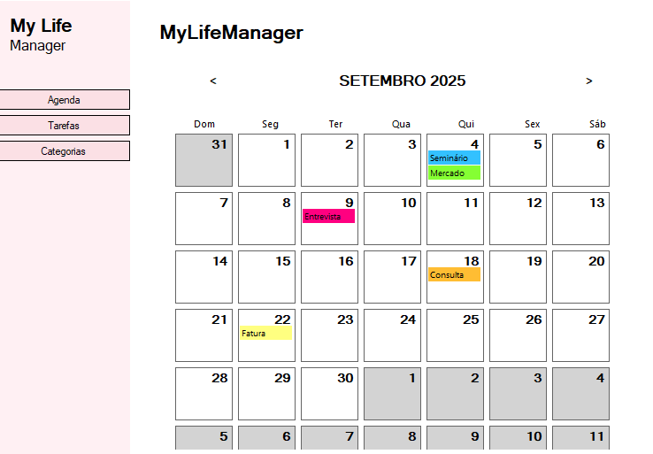
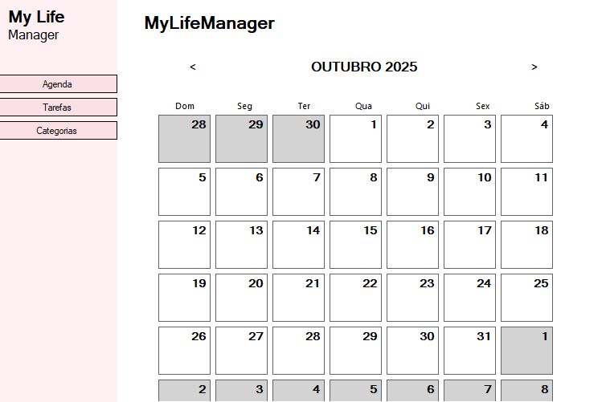
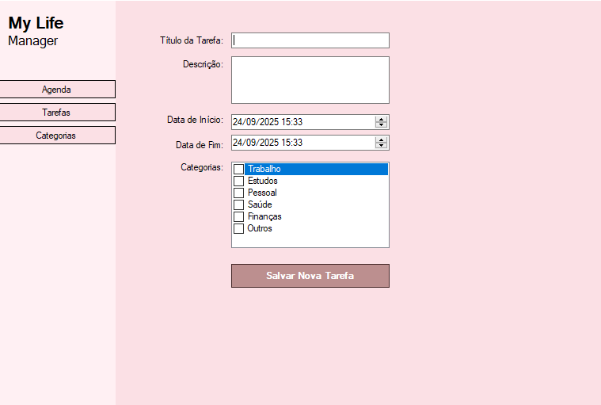
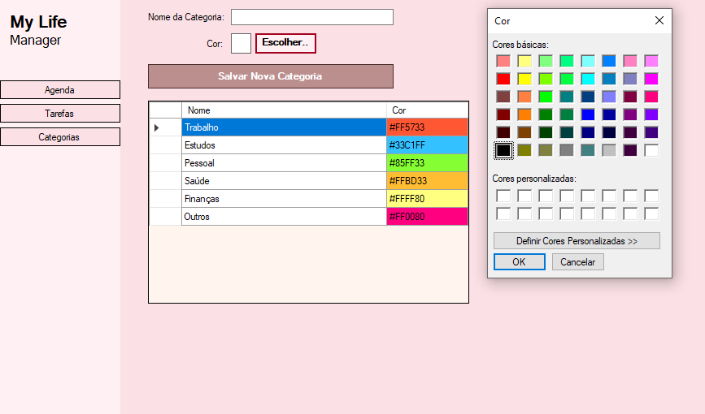
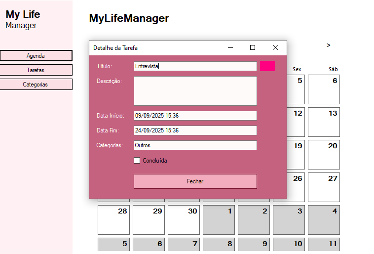

# 📆 MyLifeManager

MyLifeManager é um sistema desktop desenvolvido em C# com Windows Forms que ajuda na organização pessoal.  
Permite cadastrar tarefas, gerenciar categorias e acompanhar tudo de forma visual em um calendário mensal.  

---

## 🗄️ Funcionalidades

- **Calendário interativo**: navegação entre meses e visualização rápida das tarefas.
 
  

- **Cadastro de tarefas**: título, descrição, data de início, categoria e status de conclusão.
  
  

- **Cadastro de categorias**: organizar tarefas por categoria com cores personalizadas.
  
  

- **Detalhamento de tarefas**: ao clicar em uma tarefa no calendário, exibe informações completas.
  
 
---

## 📊 Tecnologias

- **C# com Windows Forms** – desenvolvimento da aplicação desktop.  
- **UserControls** – modularidade e organização das telas.  
- **MySQL** – armazenamento de tarefas e categorias.  
- **Visual Studio** – ambiente de desenvolvimento.  

---

## 📌 Objetivo

Desenvolver um sistema funcional para a disciplina de **Programação Orientada a Objetos (POO)**, aplicando:  

- Reuso de código com **UserControls**.  
- Integração com banco de dados **MySQL**.  
- Organização de funcionalidades em um **sistema desktop completo**.  
